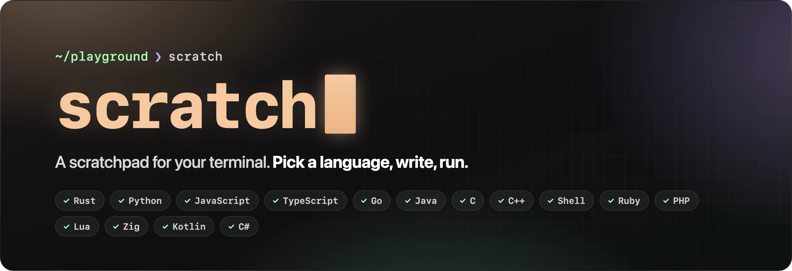
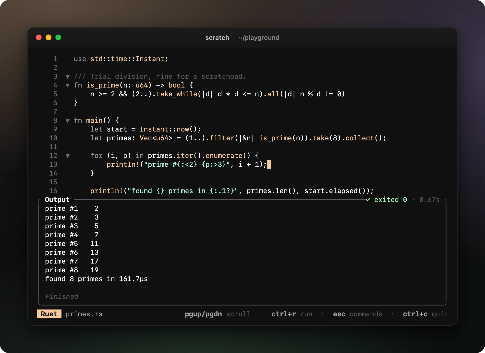
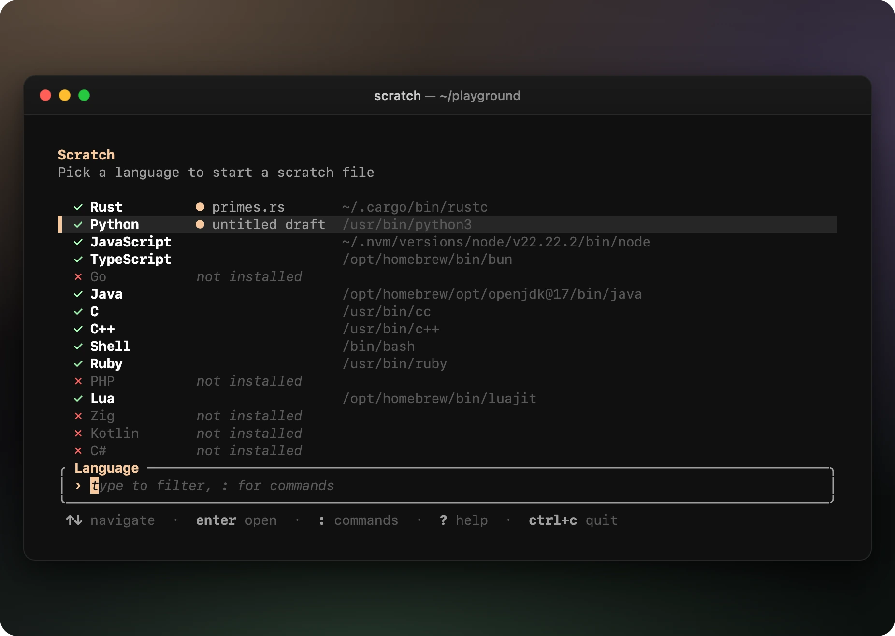
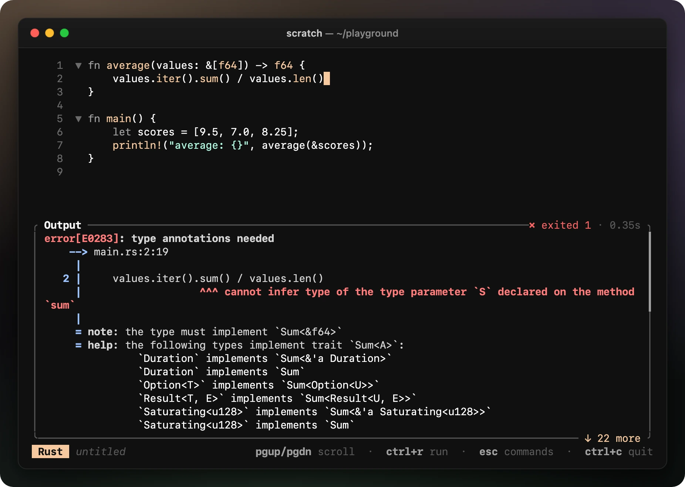
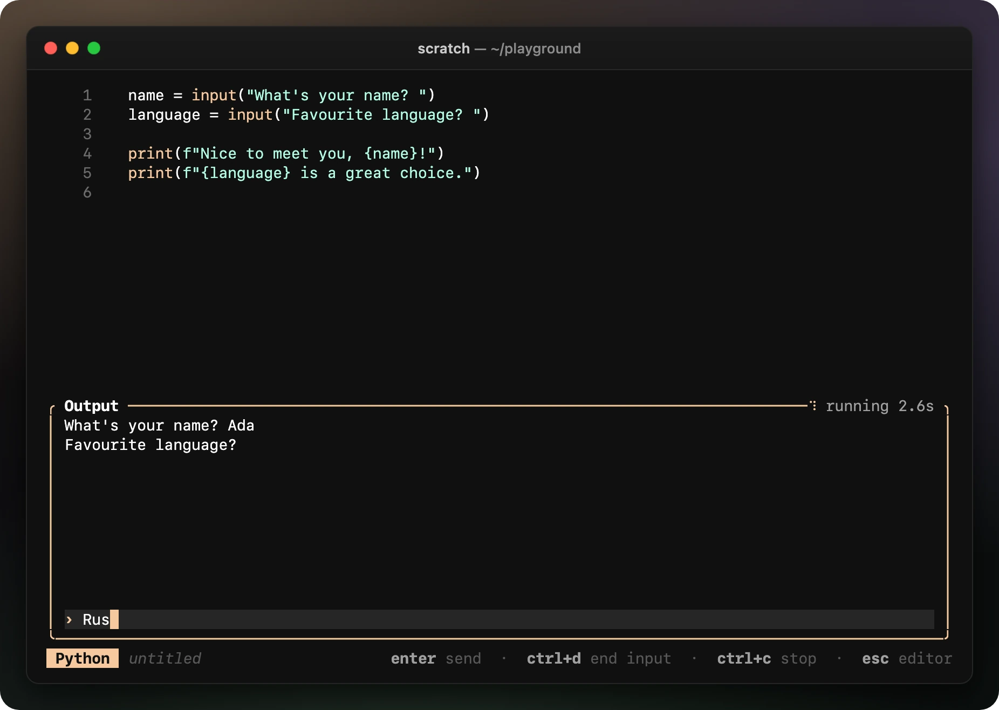
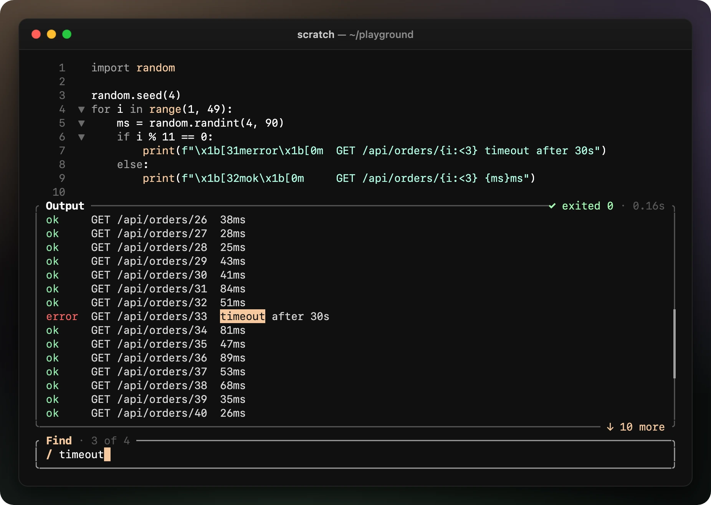
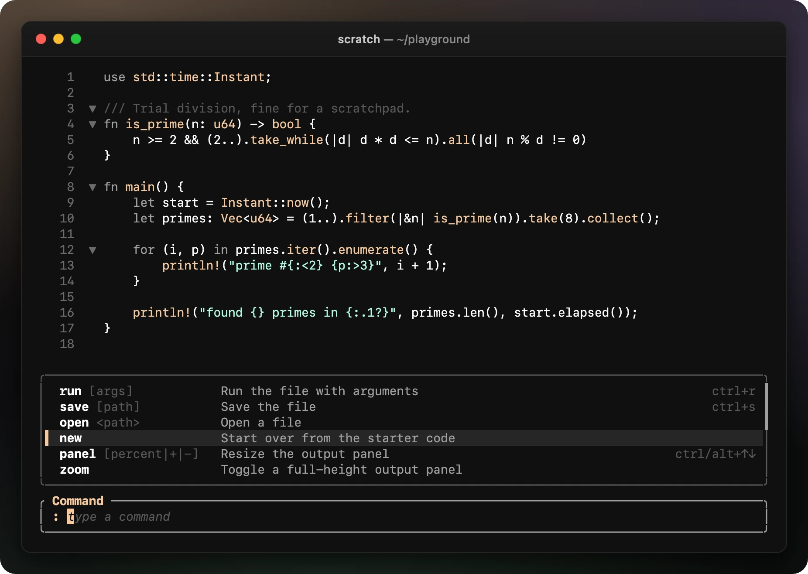

<p align="center">
  
</p>

<p align="center">
  <a href="https://github.com/gabriele-rizzo/Scratch/actions/workflows/ci.yml"></a>
  
  
  
  
</p>

<p align="center">
  <b>Try an idea without making a project.</b><br>
  Pick a language, write a few lines, press <kbd>Ctrl</kbd>+<kbd>R</kbd>, and see the output right below your code.
</p>

<p align="center">
  
</p>

## Why Scratch

You want to check how a regex behaves, time a loop, or remember whether `sort` is stable. Opening an editor, creating a folder, writing a `Cargo.toml` or a `package.json`: all of that is in the way. Scratch is a single terminal app that opens straight into a file in the language you pick, with starter code that already runs.

- **One key to run.** Output streams live into a panel under your code, in the order the program wrote it, with its own colors.
- **Programs can talk back.** Answer `input()` and `scanf` prompts from the panel, send end of input, or interrupt a runaway loop.
- **Nothing gets lost.** Every language keeps its draft between sessions, so quitting never throws work away.
- **Stays out of the way.** It sleeps when nothing is happening (0% CPU when idle) and handles programs that print millions of lines.

## Features

<table>
  <tr>
    <td width="50%" valign="top">
      
      <p><b>Pick a language.</b> Scratch finds what's installed on your machine, marks languages with a draft you can come back to, and tells you what's missing.</p>
    </td>
    <td width="50%" valign="top">
      
      <p><b>Real errors, real colors.</b> Programs run in a pseudo-terminal, so compilers and tools print exactly what you'd see in your shell.</p>
    </td>
  </tr>
  <tr>
    <td width="50%" valign="top">
      
      <p><b>Interactive programs.</b> Press <kbd>Ctrl</kbd>+<kbd>O</kbd> to type into the program. Prompts show up as they're printed, and answers land right next to them.</p>
    </td>
    <td width="50%" valign="top">
      
      <p><b>Search the output.</b> <kbd>Ctrl</kbd>+<kbd>F</kbd> highlights every match and jumps between them, even while the program is still printing.</p>
    </td>
  </tr>
  <tr>
    <td width="50%" valign="top">
      
      <p><b>Everything is a command away.</b> <kbd>Esc</kbd> opens the command palette, with Tab completion for commands and file paths.</p>
    </td>
    <td width="50%" valign="top">
      <br>
      <p><b>And the rest:</b></p>
      <ul>
        <li><code>run</code> with arguments; <kbd>Ctrl</kbd>+<kbd>R</kbd> repeats them</li>
        <li><code>watch</code> reruns on every save</li>
        <li><code>copy</code> the output (over SSH too, in most terminals)</li>
        <li><code>open</code> any file; the language comes from its extension</li>
        <li>Resize the panel by dragging it, or <code>zoom</code> it to full height</li>
        <li>Paste big snippets instantly, with indentation intact</li>
        <li><kbd>F1</kbd> lists every key and command</li>
      </ul>
    </td>
  </tr>
</table>

## Install

You need [Rust](https://rustup.rs) 1.88 or newer and a C compiler (the editor's syntax highlighting is built from C sources).

```sh
cargo install --git https://github.com/gabriele-rizzo/Scratch
```

Then run `scratch` from any folder. Files you save go there; drafts live in Scratch's own data folder.

## Getting started

1. Run `scratch` and pick a language with <kbd>↑</kbd><kbd>↓</kbd> and <kbd>Enter</kbd> (or type to filter).
2. Edit the starter code, which already prints `Hello, world!`.
3. Press <kbd>Ctrl</kbd>+<kbd>R</kbd> to run it. Press it again after every change.
4. Press <kbd>Esc</kbd> for commands, or <kbd>F1</kbd> for help. <kbd>Ctrl</kbd>+<kbd>S</kbd> saves to a real file when you want to keep one.

## Keys

| Key | What it does |
| --- | --- |
| <kbd>Ctrl</kbd>+<kbd>R</kbd> | Run (again, with the last arguments) |
| <kbd>Ctrl</kbd>+<kbd>S</kbd> | Save (and run, when watching) |
| <kbd>Esc</kbd> | Command palette |
| <kbd>F1</kbd> | Help: every key and command |
| <kbd>Ctrl</kbd>+<kbd>F</kbd> | Search the output |
| <kbd>Ctrl</kbd>+<kbd>O</kbd> | Type input for the running program (or click the panel) |
| <kbd>PgUp</kbd> / <kbd>PgDn</kbd> | Scroll the output (the mouse wheel works too) |
| <kbd>Ctrl</kbd>/<kbd>Alt</kbd>+<kbd>↑</kbd><kbd>↓</kbd> | Resize the output panel (or drag its top border) |
| <kbd>Ctrl</kbd>+<kbd>C</kbd> | Copy the selection, or quit |

<details>
<summary><b>While typing input for a program</b></summary>

| Key | What it does |
| --- | --- |
| <kbd>Enter</kbd> | Send the line |
| <kbd>Ctrl</kbd>+<kbd>D</kbd> | End the input |
| <kbd>Ctrl</kbd>+<kbd>C</kbd> | Stop the program; press again to kill it |
| <kbd>Esc</kbd> | Back to the editor |

</details>

<details>
<summary><b>While searching the output</b></summary>

| Key | What it does |
| --- | --- |
| <kbd>Enter</kbd> / <kbd>↓</kbd> | Next match |
| <kbd>Shift</kbd>+<kbd>Enter</kbd> / <kbd>↑</kbd> | Previous match |
| <kbd>Esc</kbd> | Close the search |

Searches ignore case unless you type a capital letter.

</details>

<details>
<summary><b>Editing</b></summary>

| Key | What it does |
| --- | --- |
| <kbd>Ctrl</kbd>+<kbd>Z</kbd> / <kbd>Ctrl</kbd>+<kbd>Y</kbd> | Undo / redo |
| <kbd>Ctrl</kbd>+<kbd>X</kbd> / <kbd>Ctrl</kbd>+<kbd>V</kbd> | Cut / paste |
| <kbd>Ctrl</kbd>+<kbd>A</kbd> | Select everything |
| <kbd>Ctrl</kbd>+<kbd>D</kbd> | Duplicate the line |
| <kbd>Ctrl</kbd>+<kbd>K</kbd> | Delete the line |
| <kbd>Tab</kbd> / <kbd>Shift</kbd>+<kbd>Tab</kbd> | Indent / unindent |

</details>

> [!TIP]
> On macOS, <kbd>Ctrl</kbd>+<kbd>↑</kbd> is taken by Mission Control. Use <kbd>Alt</kbd>+<kbd>↑</kbd><kbd>↓</kbd> (Terminal.app needs "Use Option as Meta key"), drag the panel's border, or run `panel 60`.

## Commands

Open the palette with <kbd>Esc</kbd>, type a command, and press <kbd>Enter</kbd>. <kbd>Tab</kbd> completes command names and file paths, and the first letters are enough: `r` runs, `s` saves.

| Command | What it does |
| --- | --- |
| `run [args]` | Run the file, passing it arguments (quotes work like in a shell) |
| `save [path]` | Save the file; a folder path saves `scratch.<ext>` inside it, and missing folders are created |
| `open <path>` | Open a file; the language comes from its extension |
| `new` | Start over from the starter code |
| `panel [percent\|+\|-]` | Resize the output panel, e.g. `panel 60` |
| `zoom` | Toggle a full-height output panel |
| `watch` | Rerun the file after every save |
| `find [text]` | Search the output |
| `copy [lines]` | Copy the output, or just its last lines, to the clipboard |
| `clear` | Close the output panel |
| `help` | Show every key and command |
| `back` | Go back to the language list |
| `exit` | Quit Scratch |

## Languages

Scratch looks for each language's tools on your `PATH`. Anything missing is listed along with what to install, including the macOS stubs in `/usr/bin` that only work once the Xcode Command Line Tools or a JDK is installed.

| Language | Runs with | Highlighting | Notes |
| --- | --- | :---: | --- |
| Rust | `rustc` | ✓ | Compiled, then run |
| Python | `python3`, `python` | ✓ | |
| JavaScript | `node`, `bun`, `deno` | ✓ | |
| TypeScript | `bun`, `deno`, `tsx` | ✓ | |
| Go | `go run` | ✓ | |
| Java | `java` | ✓ | Single-file programs (JDK 11+) |
| C | `cc`, `clang`, `gcc` | ✓ | Compiled, then run |
| C++ | `c++`, `clang++`, `g++` | ✓ | Compiled, then run |
| Shell | `bash`, `sh` | ✓ | |
| Ruby | `ruby` | | |
| PHP | `php` | | |
| Lua | `lua`, `luajit` | | |
| Zig | `zig run` | | |
| Kotlin | `kotlin`, `kotlinc -script` | | Kotlin scripts (`.kts`), so no class or `main` needed |
| C# | `dotnet run` | ✓ | Single files, .NET 10+ |

Adding a language is a single entry in [`src/runners/mod.rs`](src/runners/mod.rs): its name, file extension, starter code, the tools to look for, and how to run a file.

## How it works

- **A real terminal for every run.** Programs get a pseudo-terminal instead of pipes, so they print output line by line and in color, and stdout and stderr stay in order. Resizing the window resizes the program's terminal too.
- **Never blocks the UI.** Output is read on a separate thread and handed over in small batches. When a program prints faster than the screen can keep up, it's paused on its next write, as in a slow terminal, and memory stays flat. The last 10,000 lines are kept.
- **Stopping means stopping.** Each run gets its own process group, so interrupting a program or starting a new run also stops anything it started, like a compiler that's still running.
- **Drafts.** Each language's buffer, cursor and file are saved a second after you stop typing, and whenever you leave. Writes go through a temporary file, so a crash can't corrupt them. They live in `~/Library/Application Support/scratch/drafts` on macOS and `~/.local/share/scratch/drafts` on Linux (or `$XDG_DATA_HOME`). Set `SCRATCH_DATA_DIR` to use another folder.

## Development

```sh
cargo run                                  # try it
cargo test                                 # includes tests that run real programs on a pseudo-terminal
cargo clippy --all-targets -- -D warnings  # what CI runs, along with cargo fmt --check
```

CI runs the full test suite on Linux and macOS, and checks that the code builds on Windows. Windows has no pseudo-terminals, so programs run there through plain pipes, and resizing and interrupting are limited.

Scratch is built with [ratatui](https://ratatui.rs), [ratatui-code-editor](https://crates.io/crates/ratatui-code-editor) for editing and syntax highlighting, and [tuimon](https://github.com/gabriele-rizzo/Tuimon) for its screens.
